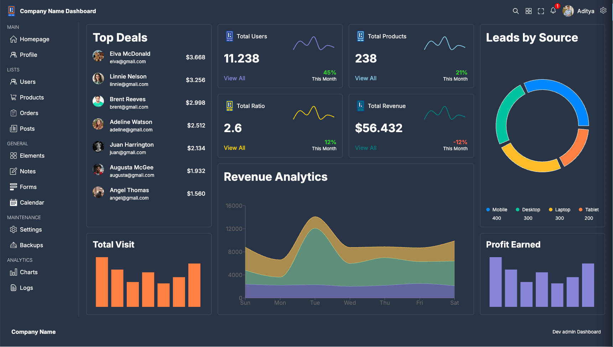

# React & TypeScript Dashboard

A simple and scalable dashboard application built using **React**, **TypeScript**, **Material UI**, and **Recharts**.  
This project is intended as a **starter dashboard / learning project** and a foundation for building more complex web applications in the future.



---

## ✨ Features

- Responsive dashboard layout
- Material UI (MUI) based design system
- Data visualization using Recharts
- Modular and scalable folder structure
- Fully typed React components with TypeScript
- Easy to extend and customize

---

## 🧰 Technology Stack

- **React**
- **TypeScript**
- **Material UI (MUI)**
- **Recharts**

---

## 🚀 Getting Started

Follow these steps to run the project locally.

### Prerequisites
- **Node.js** (v18 or later recommended)
- **npm** or **yarn**

### Installation

1. Clone the repository:
```bash
git clone https://github.com/Adit0396/CustomerDashboard.git


2. Navigate to the project directory:
cd CustomerDashboard

3. Install dependencies:
npm install

4. Start the development server:
npm start

The application will be available at:
👉 http://localhost:3000


| Command         | Description                      |
| --------------- | -------------------------------- |
| `npm start`     | Runs the app in development mode |
| `npm run build` | Builds the app for production    |
| `npm test`      | Runs tests (if configured)       |


src/
 ├── components/    # Reusable UI components
 ├── pages/         # Dashboard pages
 ├── charts/        # Chart components
 ├── theme/         # MUI theme configuration
 ├── App.tsx        # Root component
 └── index.tsx      # Application entry point

🎯 Project Goals

Provide a clean and modular dashboard foundation

Demonstrate integration of React, TypeScript, MUI, and charts

Serve as a base for future projects such as:

Admin dashboards

E-commerce panels

Analytics platforms

Personal or portfolio projects


🔮 Future Improvements

Backend integration (APIs, authentication, database)

Role-based access control

Dark mode support

Improved state management

Unit and integration testing

Performance optimizations


📬 Contact

If you have questions or feedback, feel free to reach out:

📧 adityaiyer03051996@gmail.com